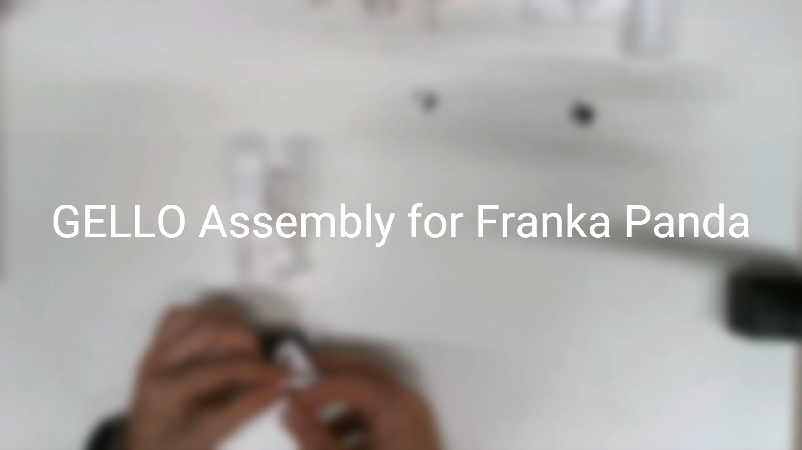
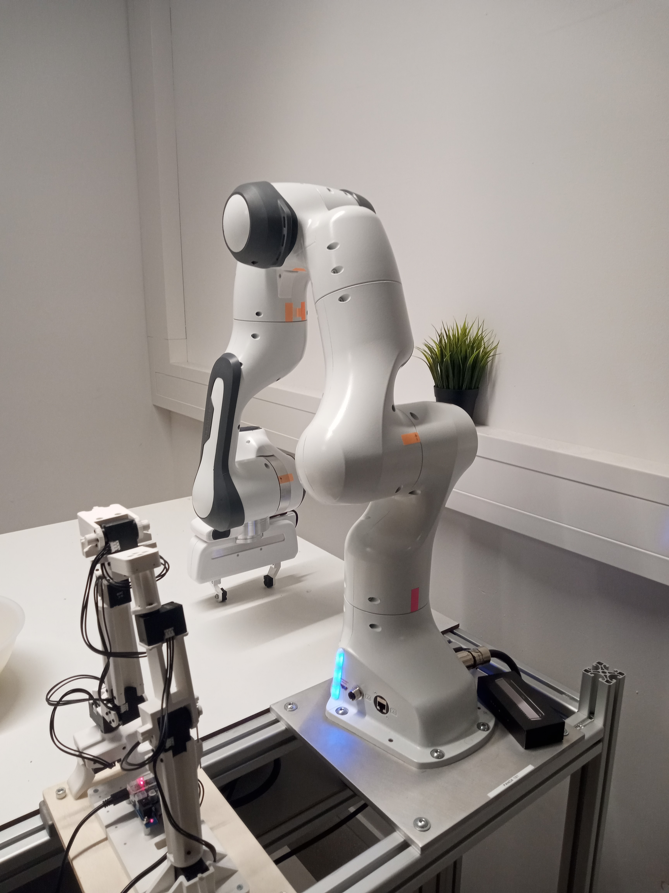
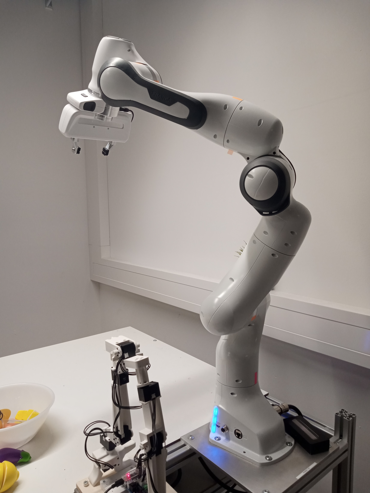
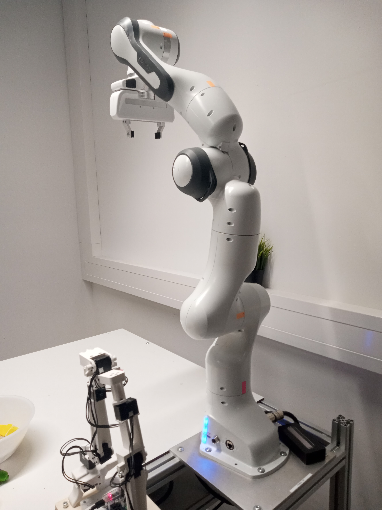
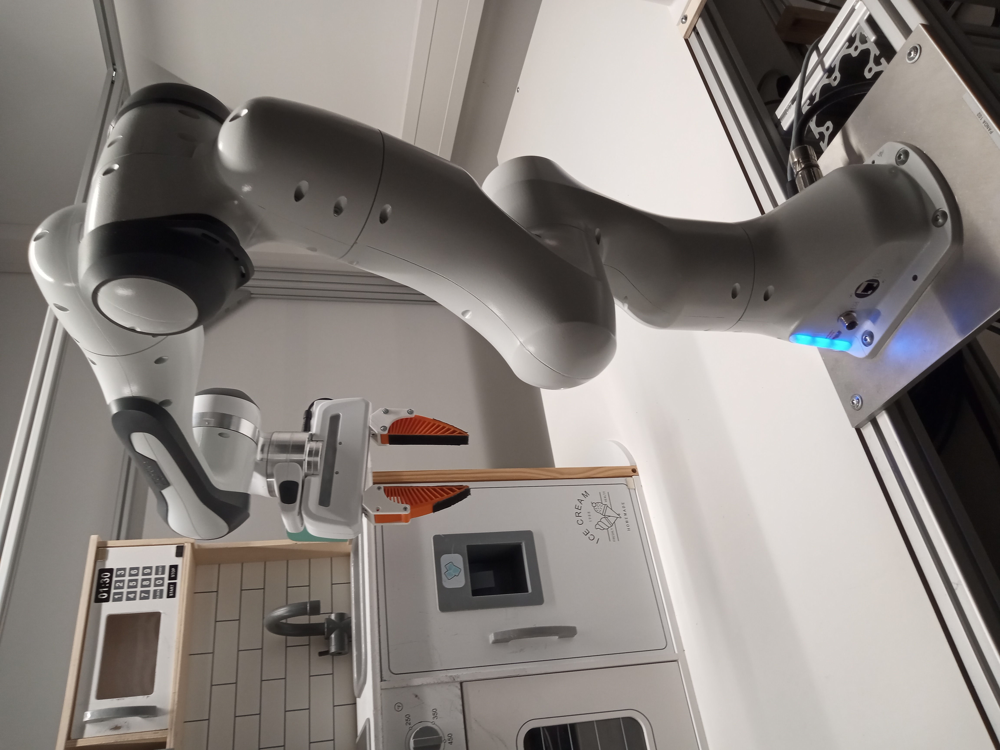
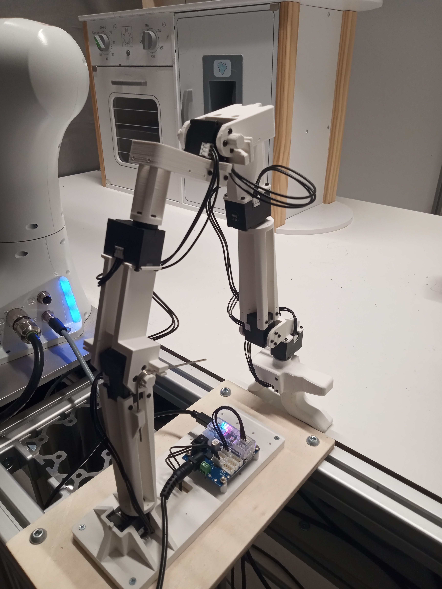
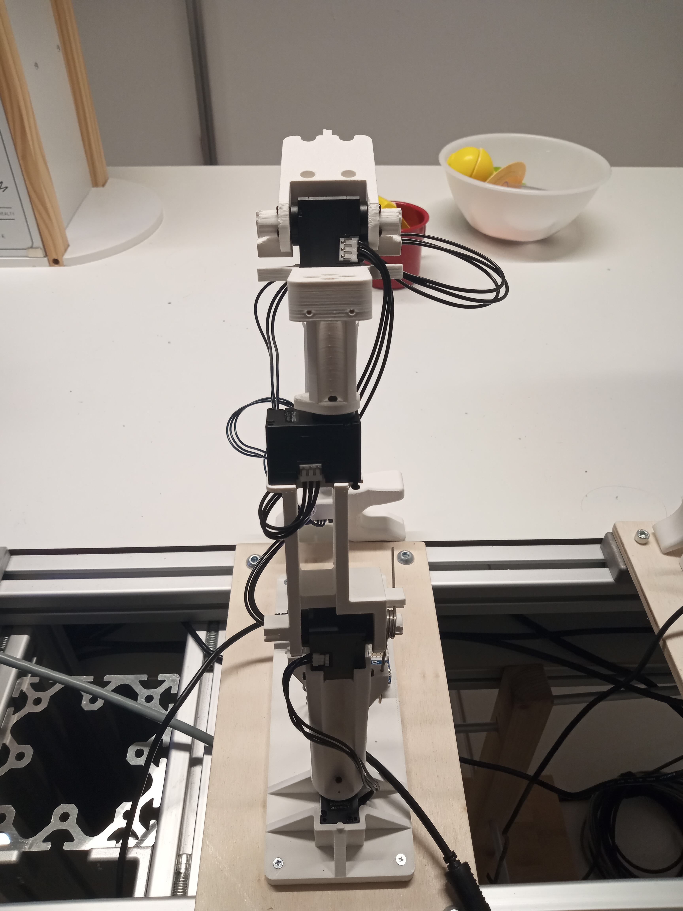
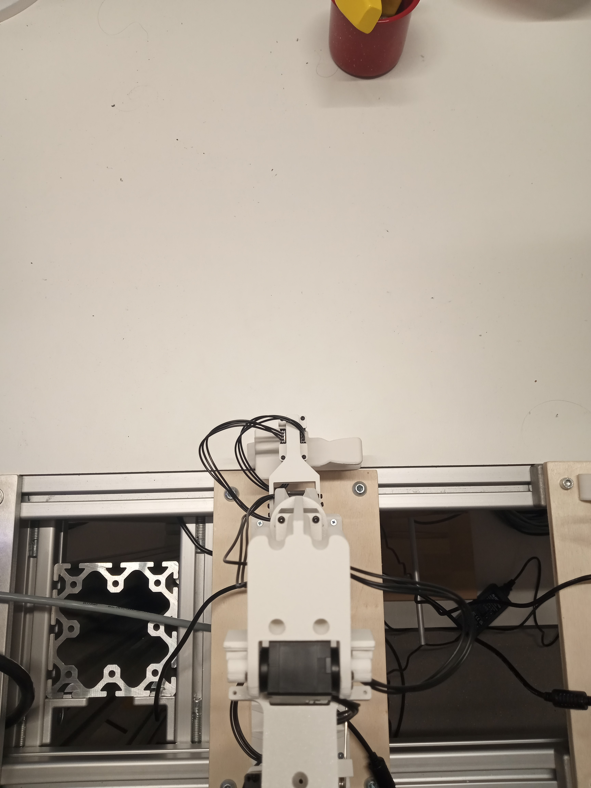
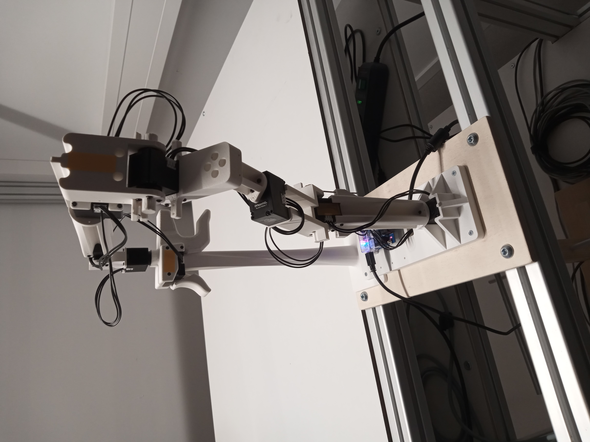

# Gello

## Introduction

This project builds on the code and hardware of [Gello](https://wuphilipp.github.io/gello_site/). We did not make changes to the hardware apart from building a different mount. Our code is split into a [fork](https://github.com/intuitive-robots/gello_software_irl) of the original Gello code and the [Real Robot repository](https://github.com/intuitive-robots/real_robot) (private repository).

We modified the Gello code to only operate as a local server that allows to read the joint values instead of containing the main control loop. Therefore, we added the script `experiments/launch_gello_server.py`, which starts this local server (Default: `127.0.0.1:6000`) and in case of bimanual control, two servers are started (Default: `127.0.0.1:6000` and `127.0.0.1:6001`).

For an example on how to use this server, check out the Real Robot repository where we implemented a robot class in the file `hardware_gello.py`. This class can be used in the `collect_data.py` script by specifying GELLO in its Hydra config, see `configs/collect_data/panda_102_gello.yaml` for an example. This can then be used in various setups, including bimanual ones, to collect data with Gello.

In the following we document the assembly and installation process as well as how to use our setup to control a Franka Panda robot and collect data.

## Setup

### Hardware Assembly

To assemble the hardware follow the [instructions of the original project](https://docs.google.com/document/d/1pzV8LDIGZh6zq8z-ZyKjUZ1ISkdCQctfu_05-ZY95eg/edit) or look at the summary below of our building process. We also recorded a video of the assembly process:

[](https://bwsyncandshare.kit.edu/s/iZ839MJwoFPG66x)


**Quick Summary**:

1. Add [Idler](https://www.robotis.us/fpx330-h101-4pcs-set/) to joints 2 and 4, use short motor screws instead of the shorter packaged screws to mount on the arm parts. *Hint*: Use tape to fixate Idler and remove later, makes screwing in easier.
2. Screw motors and parts together (dont forget the spring for the gripper!)
3. Attach cables from base to top (see section Initial Configuration)
4. Assemble controller according to manual
5. Attach 1 spring to joint 2 that pushes forward

### Software Installation

1. Create directory e.g. `~\gello` and `cd gello`
2. Clone [this repository](https://github.com/intuitive-robots/gello_software_irl)
3. Create Mamba / Conda environment e.g. `gello_env` with Python 3.10
4. `conda activate gello_env`
5. Install with:
	```
	git submodule init
	git submodule update
	pip install -r requirements.txt
	pip install -e .
	pip install -e third_party/DynamixelSDK/python
	```
6. Install the submodule [IRL Polymetis](https://github.com/intuitive-robots/irl_polymetis) and its requirements to `gello_env` (you can change the first line in `irl_polymetis/polymetis/environment.yaml` to `gello_env`)
7. Install [Real Robot](https://github.com/intuitive-robots/real_robot) either independently or as submodule and its requirements to `gello_env`

### Initial Configuration

Follow the [instructions of the original project](https://github.com/wuphilipp/gello_software?tab=readme-ov-file#gello-configuration-setup-please-read) to update the motor IDs using the Dynamixel Wizard and possibly test Gello in a simulation. There seems to be a bug that prevents the Franka gripper from working in a simulation (See this [issue](https://github.com/wuphilipp/gello_software/issues/4)). Note that we changed the script `gello_get_offset.py`. If you want to use it, check out the instruction on how to configure Gello below.

## Instructions

> **Quick Start**: The script `scripts/start_data_collection.sh` can be used to quickly start a data collection e.g. for demonstrations. However, it is targeted toward a specific setup and therefore you might need to adjust the commands and paths that it uses.

**Summary**:

1. Start Pandas
2. Start Gello
3. Configure Gello
4. Start Gello server
5. Collect data
6. Replay data
7. Shutdown

### 1. Start Pandas

1. Login on real time PC 
2. Open the websites of the Pandas in use
3. Open joints and activate FCI
4. In a terminal go to: `cd ~/irl_polymetis/scripts`
5. Start Conda environment: `conda activate irl_polymetis`
6. Run start script for robot and gripper (See IRL GitHub)
	1. `./start_gripper.sh --pc-ip=10.10.10.110 --port=50054 --conda=irl_polymetis [Panda number e.g. 102]`
	2. `./start_robot.sh --pc-ip=10.10.10.110 --port=50053 --conda=irl_polymetis [Panda number e.g. 102]`
	3. If a script was stopped and there are problem starting it again, run `sudo pkill -9 run_server`
7. For a bimanual scenario use:
	1. `./start_gripper.sh --pc-ip=10.10.10.110 --port=50052 --conda=irl_polymetis 102`
	2. `./start_robot.sh --pc-ip=10.10.10.110 --port=50051 --conda=irl_polymetis 102`
	3. `./start_gripper.sh --pc-ip=10.10.10.110 --port=50054 --conda=irl_polymetis 101`
	4. `./start_robot.sh --pc-ip=10.10.10.110 --port=50053 --conda=irl_polymetis 101`

### 2. Start Gello

1. Plugin the power cable
2. Attach the USB cable to the normal PC
3. Use switch on PCB to turn the Gello on

### 3. Configure Gello

The following steps are **required when setting up a new Gello**. However, it can also happen that the script `gello_get_offset.py` needs to be **run again after a restart**. This is probably caused by the way the Dynamixel motors initialize the rotation value.

1. Go to: `cd ~/gello/gello_software`
2. Start Conda environment: `conda activate gello_env`
3. Determine the USB port of the Gellos with `ls /dev/serial/by-id/` and search for something similar to `usb-FTDI_USB__-__Serial_Converter_[...]`. The current user needs access to the usb devices.
4. Move the Gello arm to a position where the joint values of the panda are known such as:

|  |  |  |  |
| :---------------------------------: | :---------------------------------: | :---------------------------------: | :---------------------------------: |
| Bend down arm: `0 0.3513  0 -2.7566 0 3.1154 -2.3368` | Reset pose for kitchen robot: `0.2719 -0.5165 0.2650 -1.6160 -0.0920 1.6146 -1.9760` | Stretched up arm: `-0.0040 -0.1455 -0.0226 -0.9075 -0.0373 0.8547 -2.4134` | Corresponding to GELLO stand: `0.0604 -0.3634 -0.0957 -2.1662 0.0611 1.6686 -2.4437` |
 
5. Pick one of the following scripts depending on which Gello you are using:
	- Left Gello: `python scripts/gello_get_offset.py --start-joints 0 0.3513 0 -2.7566 0 3.1154 -2.3368 --joint-signs 1 -1 1 -1 1 1 1 --port /dev/serial/by-id/usb-FTDI_USB__-__Serial_Converter_FT94ER3L-if00-port0`
	- Right Gello: `python scripts/gello_get_offset.py --start-joints 0 0.3513 0 -2.7566 0 3.1154 -2.3368 --joint-signs 1 -1 1 1 1 1 1 --port /dev/serial/by-id/usb-FTDI_USB__-__Serial_Converter_FT94EVRT-if00-port0`
6. Replace `start-joints` with the corresponding values from step 4. Note that a poor configuration can lead to the robot not being able to reach the table. We had the best results with the first start pose. In this pose the Gello should look similar to:

|  |  |  |
| :---------------------------------: | :---------------------------------: | :---------------------------------: |
| View from the side                  | View from the back                  | View from the top                 |

7. There is now also a stand for Gello to make the startup and configuration easier. If you are using it, it should look like this:

|  |
| :---------------------------------: |
| View from the back on the stand     |

8. If you are configuring a new Gello, you might have to try different values for the joint signs until no joint is inverted anymore, the signs of the joints depend on the orientation of the motor in the gello assembly.
9. Run the script until you are satisfied with the configuration and press `y` to save the configuration in `configurations/[Port Name]`.
10. If you are encountering a [port permission error](https://arduino.stackexchange.com/questions/21215/first-time-set-up-permission-denied-to-usb-port-ubuntu-14-04), try this:
	- `sudo usermod -a -G dialout $USER`
	- `sudo usermod -a -G tty $USER`
	- `sudo chmod a+rw [Device Path]`
 
### 4. Start Gello server

1. Go to: `cd ~/gello/gello_software`
2. Start Conda environment: `conda activate gello_env`
3. Run `python experiments/launch_gello_server.py` to start the server and `python experiments/launch_gello_server.py --robot=bimanual_panda` for a bimanual scenario. If your setup varies e.g. due to different hardware port names, you have to pass the script different parameters.

### 5. Collect data

1. Go to: `cd ~/gello/real_robot`
2. Start Conda environment: `conda activate gello_env`
3. Run `python ./collect_data.py +collect_data=panda_102_gello` and replace `panda_102_gello` with your Hydra config file. For bimanual control, you have to add a second robot to the config. See the Real Robot repository for more information.
4. When the script is running, follow the instructions to start a new recording. Place the Gello arm on its stand or hold it still until the robot reached its position.
5. If you move the robot outside its threshold, it will try to recover by moving back inside inside its working area and then catching up with Gello again. Therefore, move Gello carefully back inside the area and stop until the robot has caught up again.
6. To stop the recording follow instructions in the terminal to save or discard the recording

### 6. Replay data

1. Go to: `cd ~/gello/real_robot`
2. Start Conda environment: `conda activate gello_env`
3. Replay recording with other script `python ./replay_data_gello.py`
4. The script will try to replay the latest recording per default. If your setup varies from ours, adjust the script to your needs.

### 7. Shutdown

1. Close all open scripts
2. Shutdown Pandas
3. Turn off Gellos and remove cables

## Resources

- [Gello GitHub](https://wuphilipp.github.io/gello_site/)
- [Gello Assembly Instructions](https://docs.google.com/document/d/1pzV8LDIGZh6zq8z-ZyKjUZ1ISkdCQctfu_05-ZY95eg/edit#heading=h.hbbn0pp1i7p0)
- [Forked Gello GitHub](https://github.com/intuitive-robots/gello_software_irl)
- [Real Robot GitHub](https://github.com/intuitive-robots/real_robot) (private)
